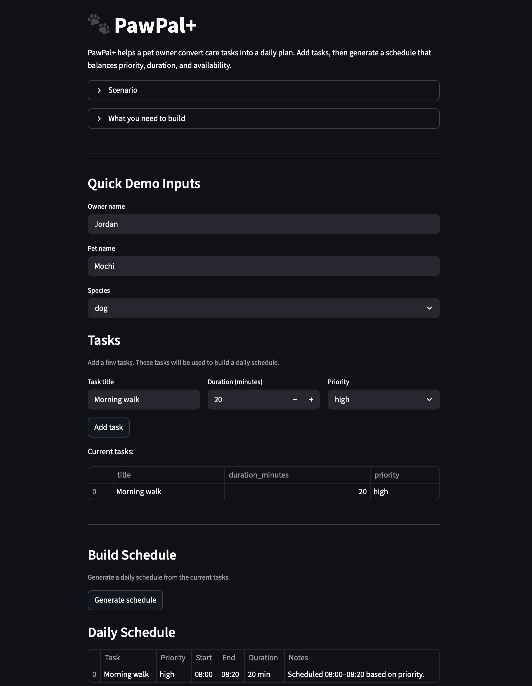
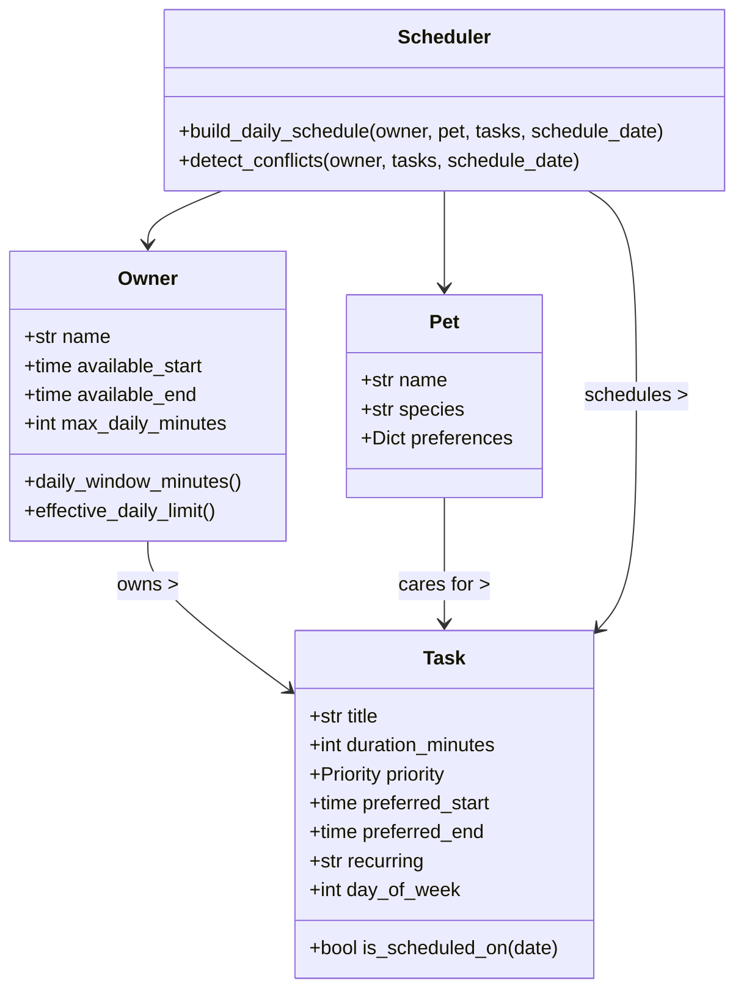

# PawPal+ (Module 2 Project)

PawPal+ is a pet care planning assistant that turns owner and pet care tasks into a daily schedule.
This implementation includes a modular scheduling backend, a Streamlit UI, a CLI demo, and automated pytest coverage.

## 📸 Demo

<a href="PawPal.png" target="_blank"></a>

## Architecture

The system is organized around three domain models:

- `Owner`: tracks availability and daily time budget.
- `Pet`: holds pet details and preferences.
- `Task`: stores task duration, priority, preferred time window, and recurrence.

A `Scheduler` builds a daily plan by sorting tasks, respecting owner availability, handling conflicts, and generating explanations.

### UML diagram



## How to run

### Install dependencies

```bash
python -m venv .venv
source .venv/bin/activate
pip install -r requirements.txt
```

### Run the Streamlit app

```bash
streamlit run app.py
```

### Run the CLI demo

```bash
python cli_demo.py
```

### Run tests

```bash
pytest
```

## Smarter Scheduling

PawPal+ goes beyond a simple task list with several algorithmic features:

- **Priority-first sorting**: Tasks are ordered high → medium → low priority. Within the same priority, earlier preferred start times are placed first.
- **Preferred window placement**: Each task can specify a preferred start and end time. The scheduler fits the task into that window or skips it with an explanation.
- **Recurring task support**: Tasks marked `daily` run every day; tasks marked `weekly` run only on a matching weekday. Calling `mark_complete()` on a recurring task returns a fresh copy ready for the next occurrence.
- **Completion tracking and filtering**: Every task tracks a `completed` flag. `Scheduler.filter_tasks()` lets you retrieve only incomplete tasks, only completed tasks, or tasks belonging to a specific pet.
- **Conflict detection**: If total task duration exceeds the owner's available time, or if two tasks have overlapping preferred windows, the scheduler surfaces a warning message instead of crashing.
- **Greedy scheduling with explanations**: Each placed task gets a plain-English note explaining why it was scheduled at that time, surfaced in both the CLI output and the Streamlit UI.

## Key behaviors

- Priority-based task ordering (`high`, `medium`, `low`)
- Owner availability enforcement
- Recurring task support (`daily`, `weekly`, `none`)
- Conflict detection when total task time exceeds available time
- Simple explanation text for scheduled tasks

## Testing PawPal+

Run the automated test suite with:

```bash
python -m pytest
```

The suite covers:

| Test | What it verifies |
|------|-----------------|
| `test_build_daily_schedule_orders_by_priority` | Tasks appear in high → medium → low order |
| `test_schedule_respects_owner_availability` | Tasks that exceed available time are excluded |
| `test_recurring_task_only_scheduled_on_matching_weekday` | Weekly tasks are filtered to the correct day |
| `test_detect_conflicts_reports_overbooked_day` | Overbooking triggers a conflict warning |
| `test_mark_complete_sets_completed_flag` | `mark_complete()` flips `completed` to True |
| `test_mark_complete_daily_returns_new_task` | Completing a daily task returns a fresh copy |
| `test_mark_complete_one_time_returns_none` | Completing a one-time task returns None |
| `test_filter_tasks_by_completion_status` | `filter_tasks()` correctly separates done from pending |

**Confidence level: ★★★★☆**

The core scheduling logic is well covered. The main gap is complex overlapping preferred-window scenarios and multi-pet filtering, which would benefit from additional parameterized tests.

## Project files

- `pawpal.py`: core domain and scheduling logic
- `app.py`: Streamlit UI connected to the scheduler
- `cli_demo.py`: command-line sample usage
- `tests/test_pawpal.py`: automated behavior tests
- `reflection.md`: design and AI collaboration notes
